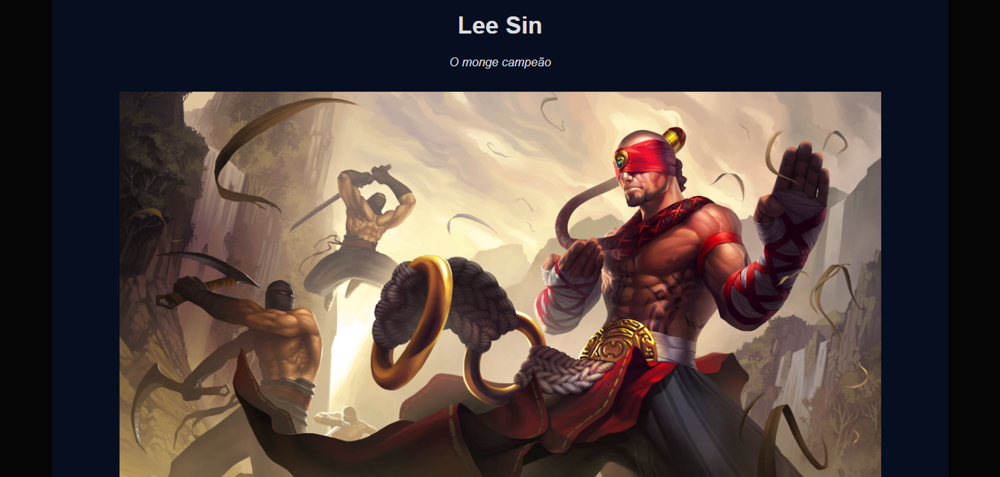
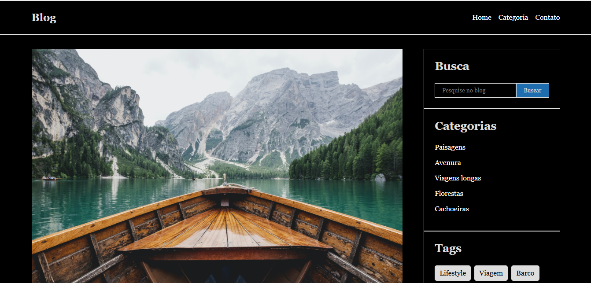

# Estudo-FrontEnd

Repositório criado durante o curso de "Formação Front-end - HTML, CSS, JavaScript, React e +".

**Projetos com HTML e CSS:**

- [Tributo](https://gustavoalbonico.github.io/Estudo-FrontEnd/HTML_CSS/PROJETOS/1_TRIBUTO/index.html)
    <a href="https://gustavoalbonico.github.io/Estudo-FrontEnd/HTML_CSS/PROJETOS/1_TRIBUTO/index.html">

</a>
- [Form](https://gustavoalbonico.github.io/Estudo-FrontEnd/HTML_CSS/PROJETOS/2_FORM/index.html)
    <a href="https://gustavoalbonico.github.io/Estudo-FrontEnd/HTML_CSS/PROJETOS/2_FORM/index.html">

</a>
- [Cruchryoll](https://gustavoalbonico.github.io/Estudo-FrontEnd/HTML_CSS/PROJETOS/3_CRUNCHROLL/index.html)
    <a href="https://gustavoalbonico.github.io/Estudo-FrontEnd/HTML_CSS/PROJETOS/3_CRUNCHROLL/index.html">

</a>
- [Instagram](https://gustavoalbonico.github.io/Estudo-FrontEnd/HTML_CSS/PROJETOS/4_INSTAGRAM_HOME/index.html)
    <a href="https://gustavoalbonico.github.io/Estudo-FrontEnd/HTML_CSS/PROJETOS/4_INSTAGRAM_HOME/index.html">

</a>
- [Blog Semântico](https://gustavoalbonico.github.io/Estudo-FrontEnd/HTML_CSS/PROJETOS/5_BLOG_HTML_SEMANTICO/index.html)
    <a href="https://gustavoalbonico.github.io/Estudo-FrontEnd/HTML_CSS/PROJETOS/5_BLOG_HTML_SEMANTICO/index.html">

</a>

**Projetos com HTML, CSS e JAVASCRIPT:**

- [Tabuada](https://gustavoalbonico.github.io/Estudo-FrontEnd/JAVASCRIPT/PROJETOS/1_TABUADA/index.html)
    <a href="https://gustavoalbonico.github.io/Estudo-FrontEnd/JAVASCRIPT/PROJETOS/1_TABUADA/index.html">

</a>
- [QR Code](https://gustavoalbonico.github.io/Estudo-FrontEnd/JAVASCRIPT/PROJETOS/2_QRCODE/index.html)
    <a href="https://gustavoalbonico.github.io/Estudo-FrontEnd/JAVASCRIPT/PROJETOS/2_QRCODE/index.html">

</a>
- [IPhone](https://gustavoalbonico.github.io/Estudo-FrontEnd/JAVASCRIPT/PROJETOS/3_CLONE_PAGINA_VENDAS_IPHONE/index.html)
    <a href="https://gustavoalbonico.github.io/Estudo-FrontEnd/JAVASCRIPT/PROJETOS/3_CLONE_PAGINA_VENDAS_IPHONE/index.html">

</a>
- [Calculadora IMC](https://gustavoalbonico.github.io/Estudo-FrontEnd/JAVASCRIPT/PROJETOS/4_CALCULADORA_IMC/index.html)
    <a href="https://gustavoalbonico.github.io/Estudo-FrontEnd/JAVASCRIPT/PROJETOS/4_CALCULADORA_IMC/index.html">

</a>
- [Lazy Loading](https://gustavoalbonico.github.io/Estudo-FrontEnd/JAVASCRIPT/PROJETOS/5_LAZY_LOADING/index.html)
    <a href="https://gustavoalbonico.github.io/Estudo-FrontEnd/JAVASCRIPT/PROJETOS/5_LAZY_LOADING/index.html">

</a>
- [TODO List](https://gustavoalbonico.github.io/Estudo-FrontEnd/JAVASCRIPT/PROJETOS/6_TODO_LIST/index.html)
    <a href="https://gustavoalbonico.github.io/Estudo-FrontEnd/JAVASCRIPT/PROJETOS/6_TODO_LIST/index.html">

</a>
- [Gerador de Senha](https://gustavoalbonico.github.io/Estudo-FrontEnd/JAVASCRIPT/PROJETOS/7_GERADOR_SENHA/index.html)
    <a href="https://gustavoalbonico.github.io/Estudo-FrontEnd/JAVASCRIPT/PROJETOS/7_GERADOR_SENHA/index.html">

</a>
- [Dev Notes](https://gustavoalbonico.github.io/Estudo-FrontEnd/JAVASCRIPT/PROJETOS/8_DEV_NOTES/index.html)
    <a href="https://gustavoalbonico.github.io/Estudo-FrontEnd/JAVASCRIPT/PROJETOS/8_DEV_NOTES/index.html">

</a>
- [Gerador de Box Shadow](https://gustavoalbonico.github.io/Estudo-FrontEnd/JAVASCRIPT/PROJETOS/9_GERADOR_BOX_SHADOW/index.html)
    <a href="https://gustavoalbonico.github.io/Estudo-FrontEnd/JAVASCRIPT/PROJETOS/9_GERADOR_BOX_SHADOW/index.html">

</a>

**Projetos com REACTJS:**

- [Calculadora IMC](https://gustavoalbonico.github.io/calculadora-imc)
    <a href="https://gustavoalbonico.github.io/calculadora-imc">

</a>
- [Multistep Form React](https://gustavoalbonico.github.io/multistep-form-react)
    <a href="https://gustavoalbonico.github.io/multistep-form-react">

</a>
- [Quiz](https://gustavoalbonico.github.io/quiz)
    <a href="https://gustavoalbonico.github.io/quiz">

</a>
- [Countdown Timer](https://gustavoalbonico.github.io/countdown-timer)
    <a href="https://gustavoalbonico.github.io/countdown-timer">

</a>
- [Blog com Axios](https://gustavoalbonico.github.io/blog-com-axios)
    <a href="https://gustavoalbonico.github.io/blog-com-axios">

</a>

**Projetos com REACTTS:**

